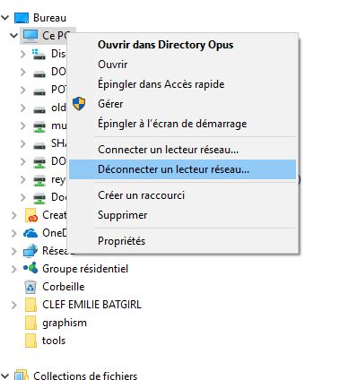

****
**Attention**, cette manipulation ne marche que si vous êtes connecté : 
- sur le réseau Eduroam de l'université de Rouen
- en filaire directement sur le réseau de l'université de Rouen
- sur un réseau autre mais avec une connexion VPN fonctionelle (voir FAQ correspondante)

Dans le cas ou vous êtes déjà dans le domaine universitaire, cette manipulation n'est pas nécessaire et vos lecteurs X: ou Z: doivent apparaitre à l'ouverture de votre session multipass. Si ce n'est pas le cas, prenez contact avec l'équipe liaison.

Pour vous **Connecter un lecteur réseau**, il suffit de faire un clic droit sur l'icone **Ce Pc** dans l'explorateur Windows (touche Windows + E) .

Une nouvelle fenêtre apparait et vous demande de saisir le dossier réseau sur lequel vous voulez vous connecter. Pour l'espace personnel, il s'agit de l'url suivante **\\\ur.univ-rouen.fr\urdatas\personnels\[loginmultipass]** ou **[loginmultipass]** doit être remplacé par votre login multipass personnel. Toujours avec notre compte multipass exemple Tyler Duprey, le login est **dupretyl **sur cette image.

Une fenetre de connexion s'ouvre, saississez là encore vos identifiants et mot de passe multipass.

Si tout c'est bien passé vous devriez maintenant avoir accès **en lecture et écriture** à votre espace personnel sur le lecteur **Y:** qui est apparu dans l'explorateur Windows.