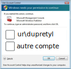

# Comment être administrateur de sa machine tout en étant dans le domaine ?

La plupart des systèmes d'exploitation \(Windows, Linux, MacOSX\) possède différent type de profils d'utilisateurs :

* administrateur
* normal
* invité
* etc.

A chacun de ces profils sont associés un certains nombre de **droits** sur la machine, comme par exemple :

* modifier les paramètre des autres utilisateurs 
* mettre à jour le système d'exploitation
* installer ou supprimer des logiciels
* etc.

Le profil **administrateur** est particulier car un utilisateur sous ce régime à l'ensemble des droits sur l'ordinateur. Il est en général déconseillé d'utiliser ce type de profil pour des raisons évidentes de sécurité.

La plupart des opérations que vous faites sur un ordinateur ne nécessite pas d'être connecté en mode administrateur, mais il est important d'y avoir **accès sur demande**, ne serait ce que pour installer ou supprimer des logiciels.

Il est possible d'être dans le domaine de l'université \(ur.univ-rouen.fr\) tout en ayant accès à un compte administrateur local. Il suffit de demander à l'équipe liaison de configurer votre ordinateur pour ce cas d'utilisation.

Prenons l'exemple d'un utilisateur fictif à l'université de Rouen : **Tyler Dupree**. Celui possède un compte multipass de login **dupretyl** ayant pour mot de passe **spin**

La machine auquel Tyler a accès dans son bureau est raccordé au domaine de l'université, autrement dit, lui comme toutes les personnes qui figure dans l'annuaire électronique \(_Active Directory_\) de l'université de Rouen peuvent ouvrir une session personnelle dessus. Il suffit de se connecter avec les informations du compte multipass.

Pour que Tyler Dupree ait la possibilité d'installer des logiciels, l'équipe liaison de son service a également créé un compte administrateur local sur cette machine, avec un login et un mot de passe générique différent du compte multipass. Comme Tyler veut un mot de passe personalisé, il change tout de suite le mot de passe de cette session locale administrateur.

* login : tyler
* mot de passe : 42spinAxis

Ainsi, tout en continuant à utiliser sa session multipass du domaine de l'université qui lui permet d'accéder aux lecteurs réseaux et à la photocopieuse, Tyler a aussi la possibilité à présent de renseigner la **fenêtre d'élévation de privilège** avec les informations de son compte administrateur local, ce qui lui permet de configurer sa machine ou d'installer des logiciels.

Dans cette **fenêtre d'élévation de privilège**, nous choisissons d'utiliser un **autre compte** pour choisir non pas le compte multipass **dupretyl** mais le compte local **tyler** qui possède les droits administrateur.

Tyler doit ensuite saisir les informations suivantes :

* **.\tyler** comme login,
* **42spinAxis** comme mot de passe. 

Le signe **.\** devant le login permet d'indiquer que l'on cherche non pas un utilisateur dans le domaine \(**ur**\), mais sur l'ordinateur local.

 _Crédit image CC : Sébastien Rey Coyrehourcq; Fuat şanlı_

