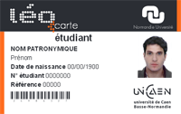

# Qu'est ce qu'un compte multipass ?

Les étudiants, personnels de l'université de Rouen bénéficie tous d'une **LéoCarte** auquel est associé un compte **multipass**.

Si la carte permet déjà d'accéder de façon physique à un certain nombre de services \(Restauration, Bibliothèque, Photocopieur\), les **identifiants** et le **mot de passe** lié à cette carte permet également d'avoir accès à de nombreux services informatiques de l'université.

La consultation ou la modification des informations/autorisations liés à ce compte \(perte ou modification du mot de passe, activation, accès aux bâtiments, etc.\) peuvent être géré par le biais du portail internet [multipass](https://multipass.univ-rouen.fr/).

