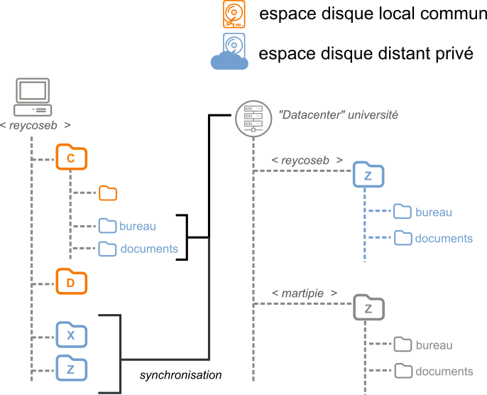
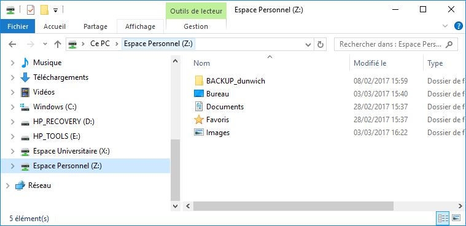
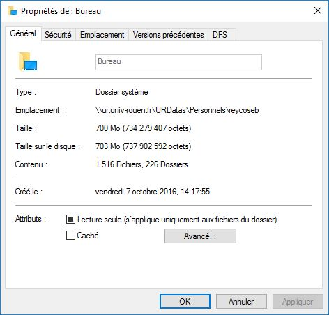
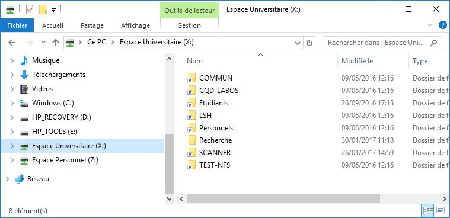

Ce _Data Center_ qui contient les différents serveurs et données de l'université est lui-même régulièrement sauvegardé et testé, ce qui en fait un espace de stockage relativement sûr pour l'ensemble de vos sauvegardes personnelles.

Comme vous pouvez le voir sur ce schéma, les dossiers en bleu (X, Z, le Bureau, les Documents, etc.) sont en réalité distants et liés à votre compte multipass (ici _<reycoseb>_). Ils n'existent pas sur le disque dur local de cette machine, et sont rattachés à celle-ci automatiquement à l'ouverture de session. Autrement dit, si un autre utilisateur ouvre une session sur ce même ordinateur (par exemple _<martipie>_) celui-ci aura accès a son propre espace personnel Z directement branché sur le _Data Center_.  

Lorsque vous déposez un fichier ou un dossier dans les dossiers **Bureau**, **Documents**, **Favoris** ou **Images** de votre ordinateur, le contenu n'est pas stocké sur votre disque dur, mais directement dans cet espace personnel Z: au sein du _Data Center_. 

Un clic droit pour accéder aux propriété du dossier **Bureau** permet d'ailleur de vérifier le chemin réel de ce dossier. On voit bien ici que l'icone pointe sur le stockage réseau suivant : _\\\ur.univ.rouen.fr\URDatas\Personnels\reycoseb_
 
Toutes les opérations faites sur ces dossiers passent donc par le réseau de l'université, ce qui peut expliquer une certaine *latence* dans les opérations lorsque les fichiers ou dossiers manipulés sont volumineux.

L'espace universitaire X: permet d'accéder à la fois d'accéder aux repertoire de partage pédagogique **Etudiants**, mais également d'accéder aux répertoires de partage dédiés à la **Recherche** 

Tout membre de l'UMR sur le site de Rouen peut avoir accès en lecture et/ou écriture à l'espace **Recherche** et aux différents groupes qu'il contient. Pour en savoir plus, le mieux est de contacter l'équipe liaison.

Il est important de noter que ces espaces ne sont pas directement  accessible en dehors du réseau de l'université, à part si vous installez et utilisez un VPN.

