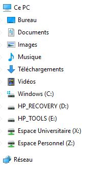

Lorsque vous vous connectez à votre session **multipass** vous pouvez voir apparaitre deux lecteurs réseaux nommés **Espace Universitaire (X:)** et **Espace Personnel(Z:)**. Si ce n'est pas le cas, reportez vous à la fiche FAQ expliquant comment vous connecter manuellement à ces espaces.

Ces deux espaces (X et Z) ne sont pas localisés sur le disque dur de votre ordinateur, mais dans le _Data Center_ de l'université de Rouen. Plus d'information est disponible dans la FAQ correspondante.
