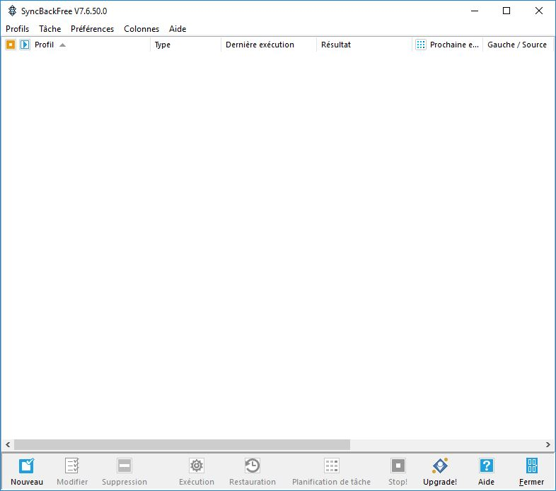
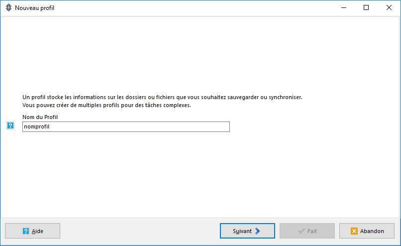
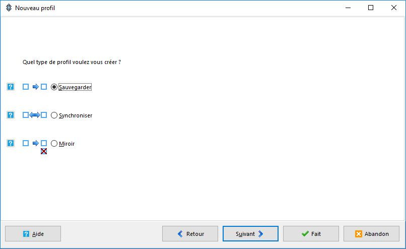
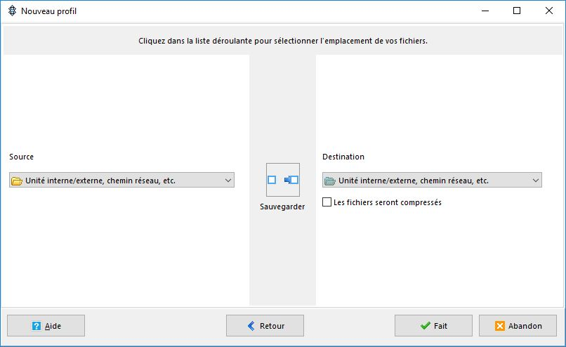
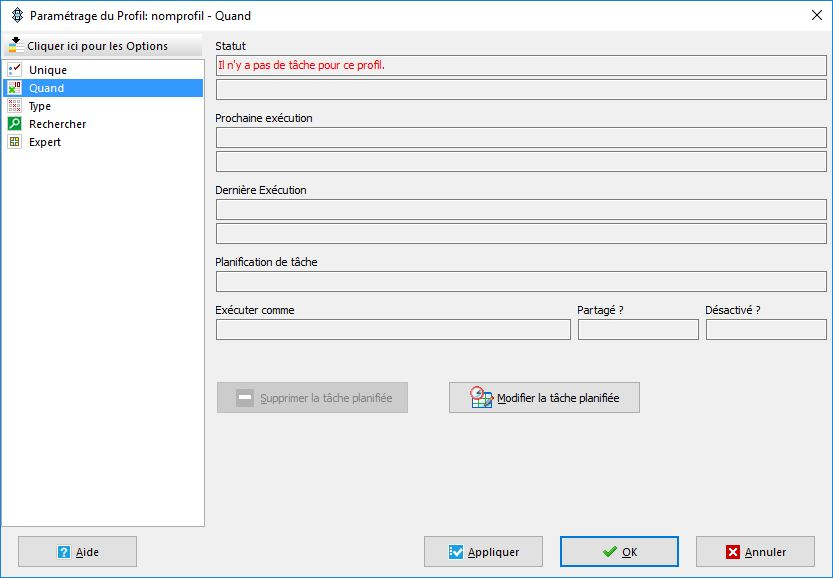

Vous ne disposez pas de sauvegarde ou de moyen de sauvegarde, mais votre ordinateur est dans le domaine de l'université ( vous utilisez pour vous connecter à votre session le compte **multipass**).

Voici un tutorial simple basé sur le logiciel gratuit **SyncBack** sous Windows, déjà pré-installé si vous utilisez l'image IRED.

Si ce n'est pas déjà fait par défaut sur votre poste, vous pouvez installer la version gratuite du logiciel de backup proposé par Brighsparks, compatible avec de nombreuses version de Windows : [SyncBackFree](https://www.2brightsparks.com/freeware/index.html)

Le logiciel permet de gérer plusieurs **profils** à la fois. Pour le moment nous allons en créer un premier en cliquant en bas à gauche sur l'icone Nouveau.

Le logiciel vous demander d'entrer le nom de votre profil, puis le type de profil que vous voulez créer.

Il faut savoir qu'une bonne sauvegarde n'est jamais destructive. Autrement dit, aucun fichier n'est jamais supprimé, ce qui vous permet en tout point de remonter dans le temps.

Avant validation, vérifier que la source de la sauvegarde ainsi que la destination sont définis comme des _Unité interne/externe, chemin réseau, etc._

La fenetre de paramétrage de profil s'ouvre ensuite. C'est dans celle-ci que la plupart des options de notre sauvegarde peuvent être modifié. Il existe un mode simple et mode avancé (utilisateur avertis). 

## Definir la source et la destination 

Pour configurer la source **Source** puis la **Destination** de nos sauvegardes, il suffit de cliquer sur chacun des dossiers jaune. 

![source_destination_rempli.JPG (images/source_destination_rempli.JPG)

Nous avons ici défini que l'ensemble du contenu existant dans le dossier **DATATOBACKUP** du disque dur local **D:\\** serait copié dans le dossier **BACKUP_dunwhich** du l'espace personnel distant **Z:\\**

## Définir la fréquence des sauvegardes

Toujours dans le paramétrage du profil, il suffit de cliquer sur l'onglet **Quand** pour obtenir les information de plannification. Comme vous le voyez pour le moment celle ci sont vides.

En cliquant sur modifier la tâche plannifié vous accéder aux différentes options de fréquence pour l'execution de votre profil de sauvegarde. Ici nous avons définis une sauvegarde **Journalière**

Une fois que vous avez fini, valider en appuyant sur le bouton ok. Une fenetre va s'ouvrir pour vous demander si vous souhaitez enlever cette limitation dans windows sur les mots de passe blanc/vide. Vous pouvez cliquer sur **Oui**.

Windows vous demande à présent votre mot de passe de session multipass. Saississez le puis cliquez sur **ok**.

Vous pouvez maintenant fermer votre la fenetre de paramétrage de profil en cliquant sur **ok**. Le logiciel va vous proposer de modifier le chemin de la destination réseau pour enlever la lettre de lecteur **Z:\\**, dites **Oui**

Vous pouvez maintenant exécuter votre première sauvegarde pour tester que tout se passe bien. Faite un **clic droit** sur le nom du profil, puis selectionner **exécuter**.

Attention lors d'une execution manuelle comme nous venons de le faire, le logiciel affiche toujours par défaut une fenetre de validation avant execution. Cela ne sera pas le cas lors d'une execution classique en tâche de fond.

Nous vous conseillons de vérifier la bonne marche de cette sauvegarde les premiers jours/premières semaines, selon comment vous avez régler la périodicité de vos sauvegardes.

## Automatiser l'exécution du logiciel au démarrage 

Comme nous l'avons dit tout à l'heure, une sauvegarde n'a d'interet que si elle est automatisé et transparente pour l'utilisateur. L'objectif est d'oublier l'existence même de celle-ci. Il est nécessaire d'indiquer au logiciel de se lancer au démarrage de Windows pour ne pas avoir à le faire manuellement.

Vous pouvez aller dans les préférences du logiciel, à l'onglet simple, pour cocher la case **Démarrer avec Windows**. Faites **ok**, puis fermer le logiciel en cliquant sur la croix, ce qui devrait en réalité minimiser l'application dans la barre des tâches.

